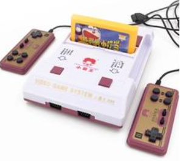

&emsp;&emsp;Many years ago,It suddenly occurred to me that Can I make a game like "Super Marry"?  
&emsp;&emsp;This game appeared when I was a child.At That time, I played it on TV game machine. That is just a simple x86 computer.  
&emsp;&emsp;I think there are two different ways to build this game. The One is using the source merterial and copying it's logic. So I colleted some merterials. But I failed to go on.  
&emsp;&emsp;Another way,I saw the machine again:  
   

&emsp;&emsp;The card inserted into the machine is the rom file, and it's the main programe file.So the machine shoud read this file to run.  
&emsp;&emsp;Can I got the rom file and wrote the semulator.  
&emsp;&emsp;First I downloaded it from the internet witch is in the folder "Fc semulate"  
&emsp;&emsp;Again I download the semulator programmes witch are written in C# or C++  

&emsp;&emsp;At last I worte is in Java language.

